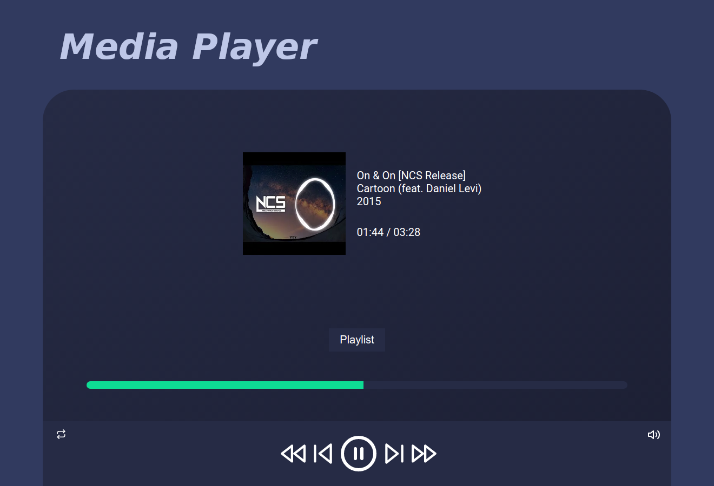

# MediaPlayer

Projeto utilizando a interface <a href="https://developer.mozilla.org/en-US/docs/Web/API/HTMLMediaElement">HTMLMediaElement<a/> e a linguagem de programação JavaScript para manipular músicas em um protótipo de player de áudio.

## Technologies used

## Preview

Live Demo: <a href="https://diegosouza007.github.io/MediaPlayer">https://diegosouza007.github.io/MediaPlayer</a>
